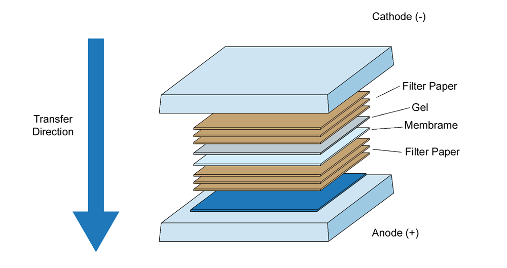
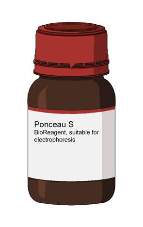
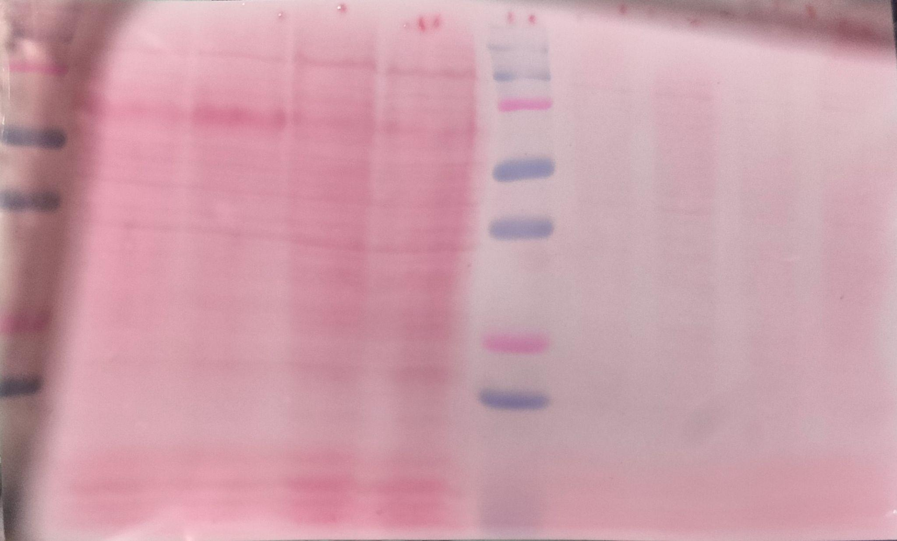
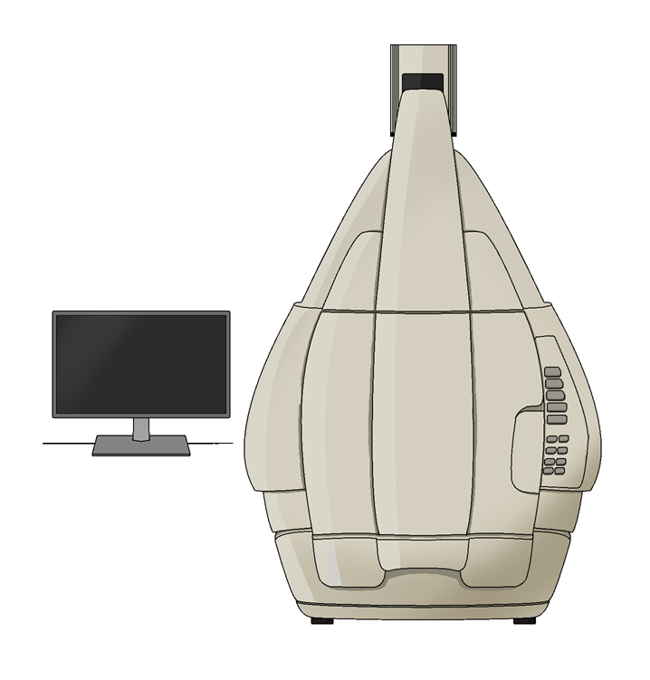
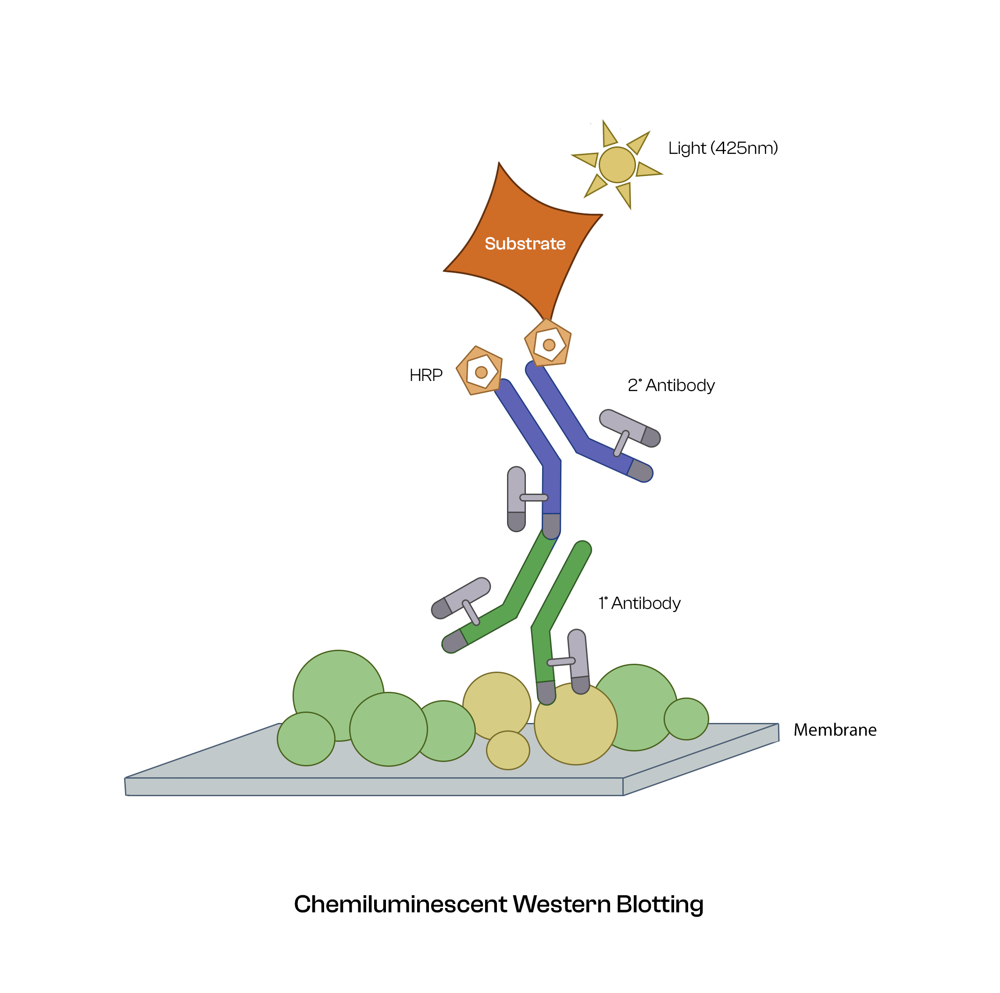

### Procedure
 

##### A) SAMPLE PREPARATION  
 

- Discard the supernatant from the 35mm2 dish and pipette cold 1X PBS over the cells dropwise. 
- Discard the PBS and add 400 µl of PBS again and scrape out the cells. 
- Centrifuge the samples at 12000g for 5 minutes at 4°C. 
- Discard PBS and add loading buffer to the cell pellet. 
- Boil the above mixture at 95 °C for 10-15 minutes. 
- Centrifuge the mixture at 12000g for 5 minutes. 
 

##### B) GEL PREPARATION  
 

- Set the casting frames on the casting stand and clamp the glass plates carefully. 
- Add water into the space between the glass plates to ensure there is no leakage. 
- Discard the water properly by absorbing any excess water using tissue paper. 
- Prepare the resolving gel solution (12%) in a falcon tube. 
- Pour the resolving gel solution slowly by pipette into the space between the glass plates, leaving ~2 cm of space above for stacking gel. 
- Add a layer of isopropanol on top of the resolving gel to make the top perfectly even and remove any bubbles. Allow the gel to solidify. 
- Discard the isopropanol layer and wash out the remaining traces of isopropanol with distilled water. 
- In the meantime, prepare a stacking gel solution (6%) in a separate tube. 
- Add the stacking gel solution until overflow and immediately insert the comb into the stacking gel, making sure no air bubbles are trapped in the gel. Allow the gel to solidify. 
 

##### C) SDS PAGE  
 

- Remove the gel cassette from the casting frame and clamp it with a dummy plate/ buffer dam to the running module. 
- Pour the 1X Tris-Glycine running buffer into the running module first, and then into the rest of the tank. 
- Carefully remove the comb from the wells and load different volumes of sample A and B into the wells along with a molecular weight marker. 
- Run the electrophoresis at low voltage ~70V till the dye front reaches the resolving gel, then increase the voltage to 100-120V and run it till the dye front leaves the gel. 
 

##### D) TRANSFERRING PROTEINS FROM GEL TO MEMBRANE  
 

- Soak the blotting sheets in transfer buffer and place them on the base of the transfer unit. 
- Place a 0.45μ nitrocellulose membrane (NCM) pre soaked in transfer buffer, on the blotting sheets. 
- Carefully align the gel over the NCM and cover the gel with two soaking sheets. Pour the remaining transfer buffer and roll with the roller to ensure proper stacking. 

 

- Run the blotting for 30 minutes at 19 V and 0.5A. 
 

##### E) BLOCKING AND ANTIBODIES INCUBATION  
 

- Briefly rinse the blot with 1X Tris Buffered- Saline with Tween (TBST) and stain it with Ponceau S solution to check the transfer of proteins from the gel to the membrane. 
 

 

- Rinse off the Ponceau S stain with three washes of TBST. 
- Block the membrane using a blocking buffer for 2 hours at room temperature. 
- Wash the membrane with TBST 2-3 times at a fast speed on a rocker. 
- Prepare 5 ml dilution of the primary antibody to be used (mostly, 1:5000, 2% BSA in TBS/TBST). 
- Add the primary antibody dilution and incubate the membrane overnight at 4ᴼC with gentle rocking. 
- Wash the membrane three times with TBST, about 5 minutes each time. 
- Incubate the membrane with the recommended dilution of conjugated secondary antibody (1:10000, 2% BSA in TBS/TBST) at room temperature for 1-2 hours with gentle rocking. 
- Wash the membrane three times with TBST, about 5 minutes each time and develop the blot with ECL reagent in a dark room. 

 
 

 
 

  

  <figure class="video_container" style="width: 600px; height: 350px;">
    <iframe style="width: 100%; height: 100%;" src="https://www.youtube.com/embed/videoseries?si=gHs0gJTXYf4T0vBT&amp;list=PLTkVi3dAX_-9uQTFRpeBPwlcE3dA2h5-e" title="YouTube video player" frameborder="0" allow="accelerometer; autoplay; clipboard-write; encrypted-media; gyroscope; picture-in-picture; web-share" referrerpolicy="strict-origin-when-cross-origin" allowfullscreen=""></iframe>
  </figure>

